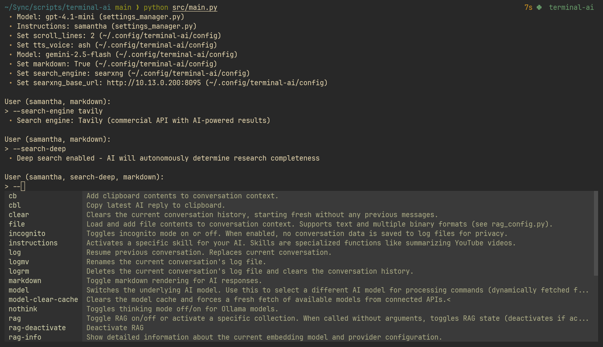

# Terminal AI Assistant



A powerful terminal-based AI assistant that combines the best of conversational AI with advanced features like RAG (Retrieval-Augmented Generation), web search, command execution, and multi-provider support.

Created from the desire to build a terminal alternative to [OpenWebUI](https://github.com/open-webui/open-webui).

## Table of Contents

- [Features](#features)
- [Installation](#installation)
- [Quick Start](#quick-start)
  - [Configurations](#configuration)
- [Usage](#usage)
  - [Core Commands](#core-commands)
  - [Content Processing](#content-processing)
  - [RAG (Document Analysis)](#rag-document-analysis)
  - [Web Search](#web-search)
  - [Conversation Management](#conversation-management)
  - [Text-to-Speech](#text-to-speech)
- [Advanced Features](#advanced-features)
- [Configuration](#configuration)
- [Shell Integration](#shell-integration)

## Features

### Core Capabilities
- **Multi-Provider AI**: OpenAI, Google Gemini, Anthropic, and Ollama (local models)
- **Intelligent Web Search**: Real-time information via Tavily API with dynamic intent analysis (temporal, factual, controversial, etc.)
- **RAG System**: Query your documents with hybrid search and intelligent retrieval
- **Content Extraction**: YouTube transcripts, website content with paywall bypass

### Advanced Features  
- **Conversation Management**: Save, resume, and organize conversations
- **Text-to-Speech**: Natural speech synthesis with multiple voices
- **Instruction Templates**: Custom AI behaviors and skills
- **Clipboard Integration**: Use clipboard content as input
- **Privacy-First**: Local processing with Ollama for sensitive documents
- **Rich Commands**: Extensible system with tab completion

## Installation

### Prerequisites
- Python 3.10+
- [Conda](https://www.anaconda.com/docs/getting-started/) (Miniconda recommended)
- API keys (optional):
  - OpenAI API key
  - Google API key  
  - Anthropic API key
  - Tavily API key (for web search)
- [Ollama](https://ollama.com/) (for local models)

### Setup

1. **Set up API keys** (add to your shell profile):
   ```bash
   export OPENAI_API_KEY="your-openai-key"
   export GOOGLE_API_KEY="your-google-key"
   export ANTHROPIC_API_KEY="your-anthropic-key"
   export TAVILY_API_KEY="your-tavily-key"
   ```

2. **Install Terminal AI**:
   ```bash
   git clone https://github.com/mdillondc/terminal-ai
   cd terminal-ai
   conda create -n terminal-ai python=3.12 -y
   conda activate terminal-ai
   pip install -r requirements.txt
   ```

3. **Run the application**:
   ```bash
   python src/main.py
   ```

## Quick Start

```bash
# Start the application
python src/main.py

# Basic usage
> --model gpt-4.1
> Hello! How can you help me today?

# Enable web search
> --search
> What's the latest news about AI?

# Analyze a YouTube video
> --youtube https://youtube.com/watch?v=example
> Summarize the key points

# Work with documents
> --file document.pdf
> What are the main conclusions?

# Enable text-to-speech
> --tts
> Tell me a joke
# The joke will be spoken aloud

# Exit the application
> quit
```

### Configuration

You can override any setting from `settings_manager.py` by creating `~/.config/terminal-ai/config`. See `config/config.example`.

Settings follow a three-tier priority system: `--input` commands override config file settings, which override defaults from `settings_manager.py`.

**Features:**
- Simple `setting = value` format
- Comments supported with `#`
- Automatic type conversion (booleans, numbers, strings)
- Graceful fallback to defaults for missing settings
- Invalid setting warnings

## Usage

### Core Commands

| Command | Description |
|---------|-------------|
| `--` | Show all available commands |
| `--model <name>` | Switch AI model (dynamically fetched from providers) |
| `--model-clear-cache` | Force refresh of available models |
| `--clear` | Clear conversation history |
| `--usage` | Show token usage and costs |

### Content Processing

| Command | Description |
|---------|-------------|
| `--file <path>` | Load file contents (text, PDF, images, etc.) |
| `--url <url>` | Extract website content with paywall bypass |
| `--youtube <url>` | Extract video transcript |
| `--cb` | Use clipboard contents |
| `--cbl` | Copy latest AI reply to clipboard |
| `--instructions <file>` | Apply instruction template |

### RAG (Document Analysis)

RAG allows you to query your own documents with intelligent retrieval.

**Setup:**
```bash
# Create document collection
mkdir -p rag/my-docs
# Add your documents to the directory

# Activate collection (builds automatically)
> --rag my-docs
> Detail my latest visit to the doctor
```

**Commands:**
| Command | Description |
|---------|-------------|
| `--rag [collection]` | Activate specific collection |
| `--rag-rebuild <collection>` | Rebuild embeddings index (smart rebuild by default) |
| `--rag-rebuild <collection> --force-full` | Force complete rebuild from scratch |
| `--rag-show <filename>` | View relevant chunks from file |
| `--rag-status` | Show RAG configuration |
| `--rag-test` | Test embedding provider connection |
| `--rag-deactivate` | Deactivate RAG |

**Smart Rebuild:**
RAG collections now use smart rebuild by default, which only processes changed files instead of rebuilding everything from scratch. This provides significant performance improvements:
- **7-12x faster** for typical use cases
- Only processes new/modified files
- Preserves embeddings for unchanged documents
- Automatic fallback to full rebuild if needed (e.g. if index is corrupted)

Use `--rag-rebuild collection --force-full` to force a complete rebuild when troubleshooting or after changing embedding settings.

**Embedding Providers:**
- **OpenAI**: High quality, cloud-based (requires API key)
- **Ollama**: Local, private, free (install: `ollama pull snowflake-arctic-embed2:latest`)

### Web Search

Intelligent web search using Tavily with LLM query optimization, generation, context awareness, and parallel processing for faster results.

```bash
# Enable web search
> --search

> what was the real secret behind the dharma initiative
 • Generating search queries...
   • Dharma Initiative true purpose and secrets explained
   • Real secret behind the Dharma Initiative in Lost TV show
 • Search mode: Auto-optimized
 • Searching (1/2): Dharma Initiative true purpose and secrets explained
   • 20 Years Later, the DHARMA Initiative Secret Finally Explained
   • DHARMA Initiative | Lostpedia - Fandom
   • Dharma Initiative - Wikipedia
 • Searching (2/2): Real secret behind the Dharma Initiative in Lost TV show
   • How the DHARMA Initiative Works | HowStuffWorks - Entertainment
   • The Others | Lostpedia | Fandom
 • Synthesizing 5 sources...
```

**Smart Features:**
- Dynamic intent detection via LLM analysis
- Conversation context awareness
- Current date awareness in queries
- Parallel query execution to significantly reduce search response times
- Multi-query strategy (1-3 optimized searches per request)

### Conversation Management

| Command | Description |
|---------|-------------|
| `--log <filename>` | Resume previous conversation |
| `--logmv [title]` | Rename current conversation |
| `--logrm` | Delete current conversation |
| `--incognito` | Toggle private mode (no logging) |

### Text-to-Speech

| Command | Description |
|---------|-------------|
| `--tts` | Toggle text-to-speech |
| `--tts-model <model>` | Change TTS model |
| `--tts-voice <voice>` | Select voice |
| `--tts-save-as-mp3` | Save responses as MP3 files |

## Advanced Features

### URL Content Extraction
Automatic paywall/access block bypass using multiple methods:
- Search engine bot headers
- Print versions
- AMP versions
- Archive.org (Wayback Machine)

### Instruction Templates
Create custom AI behaviors/prompts in `instructions/`:
```bash
> --instructions summary.md
> --youtube https://youtube.com/watch?v=example
> Summarize this video
```

Find instruction inspiration at [fabric/patterns](https://github.com/danielmiessler/fabric/tree/main/patterns).

### Mode Toggles
| Command | Description |
|---------|-------------|
| `--search` | Toggle web search mode |
| `--search-deep` | Toggle autonomous deep search mode |
| `--markdown` | Toggle markdown rendering setting |
| `--scroll` | Toggle scroll navigation (hotkey F8). Use j/k to scroll, gg for top, G for bottom |
| `--nothink` | Disable thinking on Ollama models |
| `--incognito` | Toggle private mode (no logs) |

## Deep Search Mode

The `--search-deep` command enables autonomous, intelligent web research that dynamically determines when sufficient information has been gathered to comprehensively answer complex queries.

### How Deep Search Works

Unlike basic search which performs a fixed number of searches, deep search uses an AI research agent that:

1. **Dynamic Initial Research**: AI determines how many initial search queries are needed based on query complexity
2. **Autonomous Evaluation**: Analyzes gathered information and scores completeness (1-10 scale)
3. **Gap Analysis**: Identifies specific missing information or perspectives
4. **User Choice**: When below 10/10, offers user choice to continue or stop research
5. **Targeted Follow-up**: Generates precise searches to fill identified gaps
6. **Smart Termination**: Detects diminishing returns and prevents infinite loops

### Example Deep Search Session

```bash
> --search-deep
> Write a comprehensive report on the benefits and risks of TMS for OCD treatment

Deep Search Mode Activated
AI will autonomously determine when sufficient information has been gathered...

Initial Research Strategy:
    1. TMS benefits OCD treatment clinical studies 2025
    2. TMS risks side effects OCD therapy mechanisms
    3. TMS vs traditional OCD treatments comparison
    4. Patient selection criteria TMS OCD guidelines
    5. Long-term outcomes TMS OCD treatment

Search 1: TMS benefits OCD treatment clinical studies 2025
    Transcranial Magnetic Stimulation for OCD: Latest Clinical Evidence
    TMS Efficacy in Treatment-Resistant OCD Patients
    2024 Meta-Analysis: TMS Response Rates in OCD

Search 2: TMS risks side effects OCD therapy mechanisms
    TMS Safety Profile and Contraindications
    Long-term Effects of TMS Treatment

Research Evaluation (after 5 searches):
    Completeness: 8/10
    Assessment: Good coverage of efficacy and safety, missing detailed mechanistic pathways and patient selection nuances
    Decision: Research quality is good (8/10). Continue searching for higher completeness?
    Gaps identified: mechanistic explanations, patient selection criteria, cost-effectiveness

[C]ontinue deep search  [S]top and generate response
Choice: C

Continuing research for higher completeness...

Next Research Phase:
    1. TMS neurobiological mechanisms OCD neural circuits
    2. TMS patient selection criteria contraindications OCD
    3. TMS cost effectiveness healthcare economics OCD

Search 6: TMS neurobiological mechanisms OCD neural circuits
    Neural Circuit Mechanisms of TMS in OCD Treatment

Research Evaluation (after 8 searches):
    Completeness: 9/10
    Assessment: Comprehensive coverage achieved with detailed mechanisms and selection criteria
    Decision: Research complete

Deep Search Complete: 8 searches executed, 35 unique sources analyzed
Research synthesis complete - generating comprehensive response...
```

### Deep Search vs Regular Search

| Feature | Regular Search | Deep Search |
|---------|---------------|-------------|
| **Search Strategy** | Fixed queries | Dynamic queries |
| **Evaluation** | None | AI evaluates completeness |
| **User Control** | None | Choice to continue/stop |
| **Termination** | After initial searches | When 10/10 or user stops |
| **Deduplication** | Basic | Advanced content deduplication |
| **Best For** | Quick facts | Complex research |
| **Time** | 5-10 seconds | 30-180 seconds |
| **Sources** | 3-6 sources | many more sources |

### Deep Search Settings

Configure in `src/settings_manager.py`:

```python
# Deep Search Settings
self.search_deep_max_queries = 35  # Maximum searches (safety net)
self.search_deep_max_results_per_query = 5  # Results per search
```

## Configuration

Key settings in `src/settings_manager.py`:

```python
# Default model and provider settings
self.default_model = "gpt-4.1"
self.embedding_provider = "ollama"  # or "openai"
self.ollama_embedding_model = "snowflake-arctic-embed2:latest"
self.openai_embedding_model = "text-embedding-3-small"
self.chunk_size = 1000
self.chunk_overlap = 200
self.rag_batch_size = 16
# ...
# see settings_manager.py for all settings (there are many more)
```

## Shell Integration

Create powerful AI workflows with shell aliases:

```bash
# Basic alias
alias ai='python ~/terminal-ai/src/main.py'

# Article summarizer
summarize() {
    python ~/terminal-ai/src/main.py \
        --input "--model gpt-4.1 --instructions summary.md --url $1" \
        --input "summarize this article"
}

# YouTube analyzer  
youtube() {
    python ~/terminal-ai/src/main.py \
        --input "--model gpt-4.1 --instructions summary.md --youtube $1" \
        --input "summarize this video"
}

# Usage examples:
# summarize "https://example.com/article"
# youtube "https://youtube.com/watch?v=example"
```

## Troubleshooting

### Common Issues

**Model not found:**
```bash
> --model-clear-cache
> --model gpt-4.1
```

**RAG not working:**
```bash
> --rag-test
> --rag-rebuild collection-name
```

**Ollama connection:**
```bash
# Check if Ollama is running
ollama list
# Start Ollama service if needed
ollama serve
```

### Exit Methods
- `quit`, `q`, `:q`, `:wq`, or `Ctrl+C`
- Press `q` + `Enter` during AI responses to interrupt (not exit)

---

For support or questions, please open an issue on the repository.